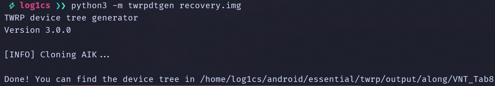
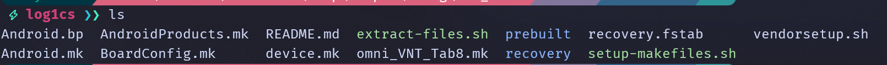
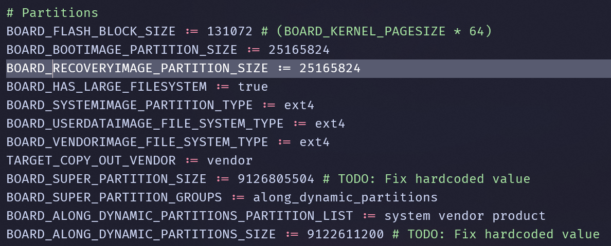

# Fastboot

## Prerequisites:
- Android platform tools: https://developer.android.com/tools/releases/platform-tools
- Google USB driver: https://developer.android.com/studio/run/win-usb (cho Windows)

## Cài đặt trước
- Vào cài đặt, bật tuỳ chọn nhà phát triển và bật mở khoá OEM.
- Bật USB debugging.
- Sau khi đã cấp quyền, sử dụng lệnh sau để vào bootloader mode:
    ```
    adb reboot bootloader
    ```
- Sau khi đã vào bootloader mode, chúng ta cần cài driver (Windows) hoặc nếu chưa cài udev rules trên Linux.
    - Sử dụng guide sau để cài driver Fastboot trên Windows:
    https://gist.github.com/luk1337/4bfab1d19ee472307f9077fba872d037
- Sau khi cài xong, để kiểm tra xem thiết bị đã được nhận chưa, quay lại platform-tools và dùng lệnh dưới để kiểm tra:
```
fastboot devices
```

Nếu kết quả trả về như dưới là thành công, còn không có thiết bị nào thì nên kiểm tra lại:
```
$ fastboot devices
List of connected devices
ABCDEF1234567           fastboot
```

## Unlock the bootloader
> [!WARNING]
> Không phải thiết bị nào cũng có thể unlock được bootloader. Không chỉ vậy, các cách unlock bootloader của các OEM sẽ khác nhau.

Để unlock được bootloader, chúng ta có thể sử dụng lệnh dưới:
```
fastboot oem unlock
```

Nếu bị trả về `unknown command`, chúng ta có thể thử tiếp lệnh nữa:
```
fastboot oem unlock-go
```

Nếu vẫn bị trả về `unknown command` thì đây là 2 lệnh cuối chúng ta có thể sử dụng:
```
fastboot flashing unlock              # Unlock bootloader
fastboot flashing unlock_critical     # Mở khoá nạp nhiều phân vùng hơn
```

Sau đó, phụ thuộc vào thiết bị, hãy follow guide ở trên màn hình thiết bị để unlock bootloader (nếu có).

## Rooting
Việc root sẽ giúp cho công cuộc vọc vạch trở nên dễ dàng hơn rất nhiều.

### Trước khi bắt đầu
Chúng ta cần chuẩn bị:
- [Magisk](https://github.com/topjohnwu/Magisk)
- Boot image, có thể được lấy bởi 2 nguồn:
  - OTA của firmware
  - Dump từ low-level flash mode

### Cách cài đặt
- Đầu tiên, chúng ta cần cài đặt app Magisk trên thiết bị.
- Bấm vào dòng `Install`
- Chọn `Select and patch a file`
- Chọn file boot image của chúng ta và bấm `Let's go` để Magisk tiến hành patch
- Sau khi patch xong, kéo file boot image ra PC và đưa thiết bị vào chế độ fastboot, và gõ:
  ```
  fastboot flash boot <magisk_patched_XXXXX.img>
  ```
- Chạy `fastboot reboot` và đợi thiết bị khởi động lên.

## Flashing GSI
GSI là một system image có thể boot được trên mọi platform, miễn là platform đó hỗ trợ Treble.

### Kiểm tra đặc điểm thiết bị
Trước khi nạp GSI, có một số thuộc tính của thiết bị cần phải biết trước khi nạp:
- Thiết bị này có phải A/B không? Hay là A-only?
- Thiết bị này có dùng dynamic partition không?
- Thiết bị này là 32-bit (arm), 64-bit (arm64) hay 32-bit chạy trong môi trường 64-bit (a32b64)?

Để giải quyết vấn đề này dễ hơn mà không phải root thiết bị, chúng ta sử dụng ứng dụng tên là [Treble Info](https://f-droid.org/en/packages/tk.hack5.treblecheck/).

| | |
|-|-|
|||

Chúng ta có thể nhận định được loại GSI mà chúng ta cần cài ngay ở home screen của ứng dụng. Tuy nhiên chúng ta cũng cần verify lại một lần nữa ở mục `Details` để chắc chắn rằng mọi thứ đã đúng.

**Các thuộc tính sau sẽ đóng vai trò rất quan trọng để chọn GSI:**
- Project Treble: Phải là Supported. Nếu không được hỗ trợ, thì rất có thể thiết bị này không có phân vùng `vendor`.
- System as Root (SAR): Nếu `Enabled`, thì phải dùng A/B GSI kể cả trên thiết bị A-only. Tìm hiểu thêm tại: [Differences between SAR and A/B](https://blog.lunarixus.dev/2020/01/the-difference-between-sar-and-ab.html).
- Seamless Upgrades: Đây là flag để xem thiết bị này có phải A/B không.
- Dynamic Partitions: Sẽ là `Enabled` nếu máy có phân vùng `super`. Nếu như thiết bị nào có Dynamic Partitions thì sẽ phải sử dụng `fastbootd` thay vì `fastboot` thông thường.
- CPU architecture && Binder architecture:
    - CPU: ARM64 && Binder: 64-bit: Đây là full ARM64.
    - CPU: ARM && Binder: 64-bit: Đây là CPU ARM64, nhưng userspace lại chạy ở mode 32-bit.
    - CPU: ARM && Binder: 32-bit: Đây là full ARM32.

### Thông tin về các distro GSI
Sau khi chúng ta đã kiểm tra xong mọi thứ, đã đến lúc tìm GSI để cài đặt.

Có một vài GSI phổ biến dưới đây:
- [phhGSI](https://github.com/phhusson/treble_experimentations): Đây là GSI được build bởi phh, thường sẽ chỉ thuần AOSP, tương thích cao vì nhiều workaround cho nhiều chipset khác nhau.
- [TrebleDroid GSI](https://github.com/trebledroid): Được build trên nền của phhGSI, TrebleDroid có những bản phân phối distro khác nhau của AOSP như: LineageOS, Pixel Experience,...
- sGSI: Các bản OEM GSI, có thể nói đơn giản là hệ điều hành stock của các thiết bị đó được port sang thành dạng GSI. Ví dụ như MIUI GSI, ColorOS GSI,...

GSI có rất nhiều biến thể và có thể tìm thấy được trên Google một cách dễ dàng. Vấn đề của GSI đó chính là không phải máy nào cũng có thể boot được hoặc thường yêu cầu workaround.

### Cài đặt GSI
Sau khi tải xuống GSI, mở terminal tại thư mục có chứa `fastboot`:

- Kết nối thiết bị ở chế độ fastboot (bootloader).
- Nếu thiết bị hỗ trợ Dynamic Partitions thì nhập lệnh dưới để vào fastbootd:
    ```
    fastboot reboot fastboot
    ```
- Sau đó, chúng ta tiến hành wipe system:
    ```
    fastboot erase system
    ```
- Sau khi xoá system xong, chúng ta tiến hành nạp GSI bằng cách:
    ```
    fastboot flash system path/to/your/gsi.img
    ```

> [!TIP]
> Trong một số trường hợp, chúng ta không thể nạp GSI được vì phân vùng không đủ dung lượng. Với các thiết bị không phải là Dynamic Partition thì nên dừng tại đây, còn ngược lại thì chúng ta có thể xoá các phân vùng không cần thiết như `product` (chứa Google apps) bằng cách dùng lệnh `fastboot delete-logical-partition product` để xoá và nạp lại GSI.

- Sau khi nạp xong GSI, chúng ta cần xoá dữ liệu đi vì giữ lại data cũ sẽ gây xung đột bằng cách chạy lệnh sau:
    ```
    fastboot -w
    ```
- Reboot và cầu nguyện rằng GSI boot thành công :)

> [!TIP]
> Nếu GSI không boot kể cả khi đã chọn đúng variant, có nhiều nguyên nhân gây ra nhưng phổ biến nhất là 3 nguyên nhân sau đây:
> - SELinux enforcing gây ra việc một vài thành phần bị block nên ROM không boot. Workaround: [Permissiver_v5](https://sourceforge.net/projects/sgsi137/files/Permissiver%20v5.zip/download). Một số thiết bị khi sử dụng workaround này (đặc biệt là MediaTek) sẽ gây boot loop vì kernel chỉ boot với enforcing mà không boot với permissive.
> - Chưa tắt kiểm tra signature của vbmeta nên kể cả khi bootloader đã unlock rồi nhưng vbmeta chưa tắt check -> boot loop. Chúng ta cần tắt dm-verity bằng cách sử dụng `fastboot flash vbmeta --disable-verify --disable-verification vbmeta.img` trong bootloader. `vbmeta` có thể được lấy từ dump hoặc backup của firmware.
> - HAL crash. Cái này cần sử dụng các thủ thuật debug để lấy log, sau đó patch các HAL cần thiết để boot Android mới hơn.

## Building TWRP
TWRP khá là hữu dụng trong việc debug và là một trong những custom recovery tốt trong giới modding nhưng để build TWRP thì cần rất nhiều tài nguyên.

Để build được TWRP, chúng ta cần chuẩn bị recovery.img hoặc boot.img (cho máy không có phân vùng recovery).

Vì build TWRP tốn rất nhiều thời gian, chúng ta sẽ sử dụng [twrpdtgen](https://github.com/twrpdtgen/twrpdtgen) để tạo device tree bằng việc sử dụng recovery image có sẵn của stock. Follow guide của twrpdtgen để cài đặt.

### Backing up recovery image
Có 3 cách để lấy được một phân vùng trên thiết bị Android:
- Sử dụng low level flashing tool (EDL backup, mtkclient, SP Flash Tool readback, ...)
- Sử dụng root để backup phân vùng
- Sử dụng file OTA có sẵn từ nhà sản xuất

### Set up a TWRP device tree
Sau khi có được recovery image và cài đặt thành công twrpdtgen, chúng ta tiếp tục với bước generate device tree:

```
python3 -m twrpdtgen path/to/your/recovery_image.img
```



Kết quả sẽ được một device tree để build TWRP:



Chúng ta phải nhớ tên thư mục đằng sau output/ để sau còn bỏ vào source của TWRP để build.

Chẳng hạn: Output của VNT_Tab8 là:
```
Done! You can find the device tree in /home/log1cs/android/essential/twrp/output/along/VNT_Tab8
```

Thì sau chúng ta sẽ cần bỏ device tree của TWRP vào device/along/VNT_Tab8.

Sau đó chúng ta có thể clone source code của TWRP về và build, cũng như fix lỗi trong lúc compilation.

Phụ thuộc vào target mà chúng ta sẽ chọn clone source code của TWRP phiên bản nào.

Kiểm tra trong `BoardConfig.mk` của device tree chúng ta vừa generate ra để kiểm tra xem size của phân vùng recovery là bao nhiêu. Thường >= 64MB sẽ có thể dùng được twrp-12.1 hoặc mới hơn. Còn <= 30MB thì nên dùng twrp-11.



Đầu tiên chúng ta sẽ cần [clone manifest của TWRP](https://github.com/minimal-manifest-twrp/platform_manifest_twrp_aosp). Dựa vào thông tin obtain được ở trên, chúng ta tiến hành clone theo hướng dẫn của README.md.

Sau đó thì copy device tree vừa generate ra bằng cách:

```
cp -r path/to/twrpdtgen_output/<MANUFACTURER>/ <TWRP_ROOT_SOURCE_DIR>/device/
```

Và tiến hành build bằng cách:

```
. build/envsetup.sh
lunch twrp_<TARGET>-eng
mka adbd recoveryimage       # Với thiết bị có recovery
mka adbd bootimage           # Với thiết bị dùng boot làm recovery
```

> [!NOTE]
> Quá trình build sẽ diễn ra trong khoảng từ 25-30 phút.

Nếu quá trình build thành công, TWRP sẽ nằm ở `out/target/product/recovery.img`. Nạp vào thiết bị bằng cách:

- Kết nối máy ở chế độ fastboot, và sử dụng lệnh:
    ```
    fastboot flash recovery path/to/recovery.img
    fastboot reboot
    ```
    và dùng phím cứng để reboot vào recovery.

### Các thứ cần check trong TWRP:
- Boot 
- Touch screen 
- Partition mounting (/system /vendor /product /data)
- Encryption (có thể bỏ qua)

Ví dụ về một device tree của TWRP được generate bằng `twrpdtgen` và các fixes dành riêng cho thiết bị: https://github.com/log1cs/android_device_along_VNT_Tab8-twrp

> [!NOTE]
> Cách fix decryption của từng thiết bị sẽ khác nhau. Chẳng hạn như các thiết bị của MediaTek không có solution TEE riêng nên phải bám víu vào các vendor như TrustKernel hoặc Trustonic, khiến cho việc fix encryption trở nên khó khăn hơn rất nhiều vì bị phân mảnh và mỗi lần fix lại như một learning curve.
>
> Qualcomm thường dùng solution TEE của riêng họ và bao nhiêu năm nay vẫn vậy nên việc fix sẽ dễ dàng hơn rất nhiều.
